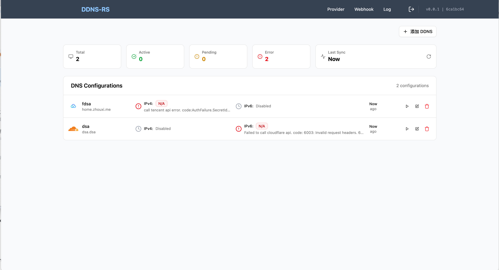

# DDNS-RS

一个用 Rust 写的 DDNS 客户端

# 提供商

- [x] Cloudflare
- [x] Tencent/Dnspod
- [x] Aliyun

# Feature

- [x] 支持`命令行`/`网卡`/`http请求` 获取ip地址
- [x] 支持指定同步间隔

# 待办

- [ ] 按正则过滤ip地址
- [ ] 默认过滤内网地址
- [ ] Log页按配置过滤日志
- [ ] 允许设置ip地址时自定义参数
- [ ] 安装为系统服务

# 截图



# 安装

* `run` 为子命令
* `-c` 指定配置文件地址，不存在时会自动创建，不指定的情况下按操作系统自动生成位置
```shell
ddns-rs run -c /etc/ddns-rs/ddns-rs.conf
# 表示配置文件保存在 /etc/ddns-rs/ddns-rs.conf
```

访问地址:  http://ip:6789

## Openwrt

```shell
# 下载ipk包后替换为具体的包名
# 自动注册为系统服务
opkg install ddns-rs-*.ipk
```

## Linux

下载RELEASE后解压执行，(暂时未实现安装为后台程序)

```shell
./ddns-rs
```

[Release](https://github.com/me0106/ddns-rs)

## 配置文件位置

* OpenWrt(通过ipk包安装): `/etc/ddns-rs/ddns-rs.conf`

* linux: `~/.config/ddns-rs/ddns-rs.conf`

* windows: `程序运行目录`

# Callback 配置

变量插入使用 `#{var}` 语法
支持的变量:

* `domain`
* `ipv4.addr`
* `ipv4.state`
* `ipv4.message`
* `ipv6.addr`
* `ipv6.state`
* `ipv6.message`

Callback配置使用类似raw http请求语法:

```http request
# POST 请求
POST https://example.com/
Content-Type: application/json  # Header部分

{               
    "domain": "#{domain}",
    "ipv4Addr": "#{ipv4.addr}"
}

```